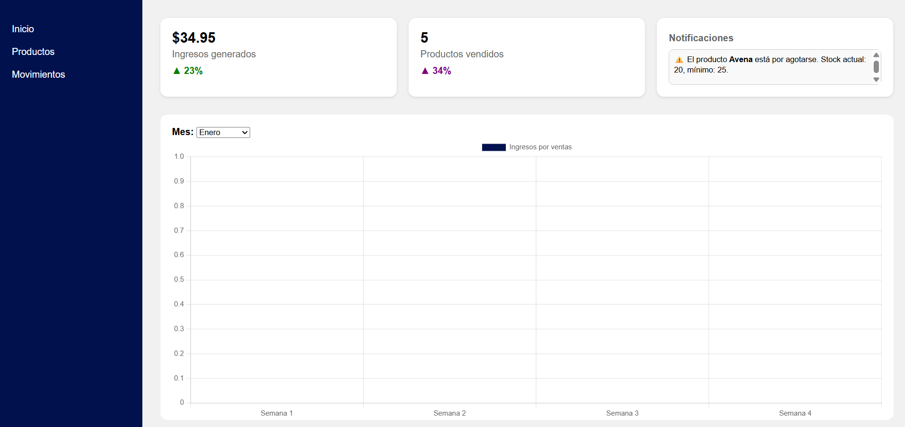

# Sistema de Inventario 🛒

Gestión de inventario para una **tienda de conveniencia**.  
Automatiza altas, bajas y modificaciones de productos, muestra métricas de ventas y lanza alertas cuando el stock se agota.

> Proyecto universitario • Patrón **MVC** • PHP 8 + MySQL + HTML/CSS/JS

---

## Tabla de contenidos

- [Autores](#autores)
- [Demo](#demo)
- [Funcionalidades](#funcionalidades)
- [Justificación](#justificación)
- [Tecnologías](#tecnologías)
- [Instalación](#instalación)
- [Estructura del proyecto](#estructura-del-proyecto)

---

## Autores

- Sandra Vanessa Rodríguez Arechiga  
- Juan Pablo Gomez Avalos

## Demo

> Abre `http://localhost/actividad/public/index.php` despues de instalar(se ejecuta en el index.php)  
> 

---

## Funcionalidades

- **CRUD de productos**  
  - Alta con: nombre, precio, stock mín/máx, categoría, descripción y código.
  - Edición de cualquier dato.
  - Borrado (soft delete) o desactivación.
- **Búsqueda avanzada**  
  - Filtros por nombre, categoría y rango de precio.
- **Alertas automáticas**  
  - Notificación cuando el stock ≤ mínimo.
- **Dashboard**  
  - Ventas totales, ingresos y notificaciones de stock bajo.
- **Reportes básicos** de inventario en pantalla.
---

## Justificación

Las tiendas pequeñas/medianas suelen llevar inventario en hojas de cálculo → errores humanos, sobre-stock o faltantes.  
Con este sistema:

- Se **automatiza** la actualización de stock.
- Se genera **alerta temprana** de productos críticos.
- Se obtiene un **panorama claro** de ventas e ingresos para decisiones rápidas.

---

## Tecnologías

| Capa | Tech |
|------|------|
| Frontend | HTML, CSS, JavaScript  |
| Backend  | PHP 8.2 • Mini-framework MVC propio |
| BD       | MySQL / Apache |
| Entorno  | XAMPP (Apache 2.4, PHP 8, MySQL) |

---

# Estructura del proyecto

El proyecto sigue una arquitectura basada en el patrón **MVC (Modelo-Vista-Controlador)**. A continuación se describe brevemente la función de cada carpeta y archivo principal:

## app/

Contiene el código principal de la aplicación:

- **controllers/**: Lógica de control. Cada archivo gestiona las acciones de las vistas y los modelos.

  - `DashboardController.php`  
  - `MovimientoController.php`  
  - `ProductoController.php`

- **models/**: Representa las entidades y gestiona la interacción con la base de datos.

  - `Producto.php`  
  - `categoria.php`  
  - `movimiento.php`

- **views/**: Contiene las vistas que se muestran al usuario.

  - `crear.php`  
  - `editar.php`  
  - `eliminar.php`  
  - `ver.php`  
  - `productos.php`  
  - `movimientos.php`  
  - `dashboard.php`  
  - `layout.php`

## config/

- `database.php`: Configuración de conexión a la base de datos.

## public/

Archivos públicos accesibles desde el navegador (HTML, CSS, JS, imágenes, etc.):

- **css/**: Estilos personalizados del sistema.

  - `styles.css`  
  - `styles_productos.css`

- **js/**: Scripts JS para interacción dinámica.

  - `buscarProd.js`  
  - `modalCrear.js`  
  - `modalDelete.js`  
  - `modalEditar.js`  
  - `modalVer.js`  
  - `script.js`

- `index.php`: Archivo principal que carga la aplicación.

- `text.php`: Archivo auxiliar para contenido dinámico.

- `.htaccess`: Configuración para URLs amigables.

## routes/

- `web.php`: Define las rutas internas del sistema, conecta URLs con controladores.

## Otros archivos

- `inventario.sql` / `inventory.sql`: Archivos de respaldo para importar la base de datos.
- `image.png`: Imagen de apoyo o vista previa del sistema.
- `README.md`: Documentación general del proyecto.


## Instalación
> Probado en Windows 11 con XAMPP

```bash
# 1. Clona el repo
git clone https://github.com/Sandra0602/Inventory.git

# 2. Copia la carpeta en htdocs (o tu directorio público)
#    Ej: C:\xampp\htdocs\actividad

# 3. Importa la base de datos
#    - Abre http://localhost/phpmyadmin
#    - Crea BD llamada inventario
#    - Importa database/inventario.sql

# 4. Inicia Apache y MySQL desde el panel de XAMPP

# 5. Abre en el navegador
http://localhost/actividad/public/index.php 

--